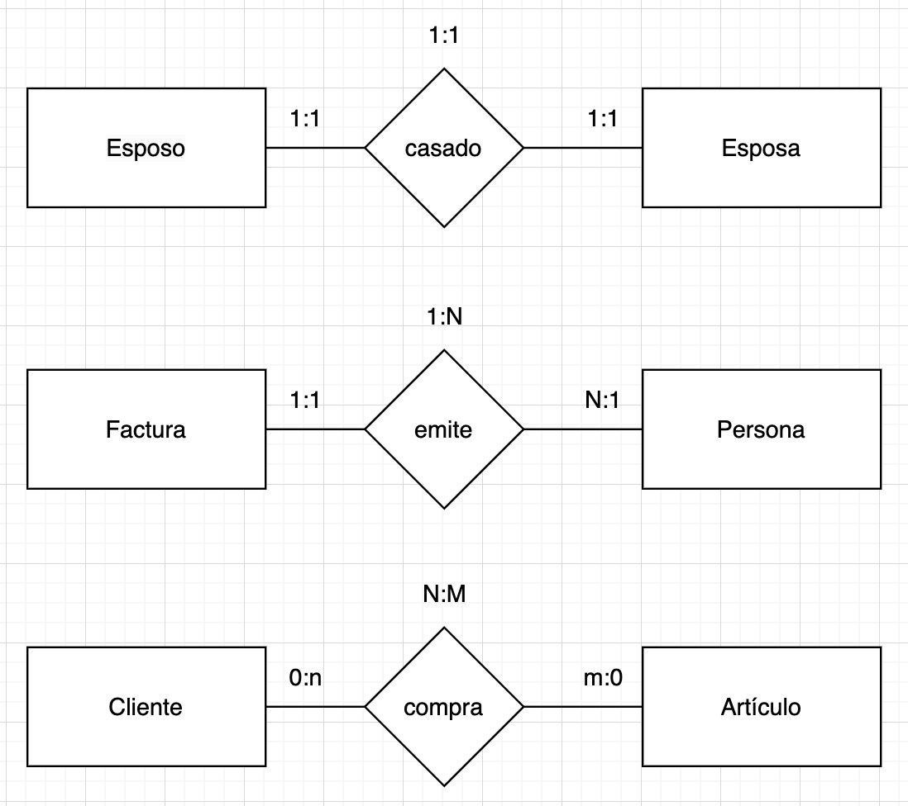
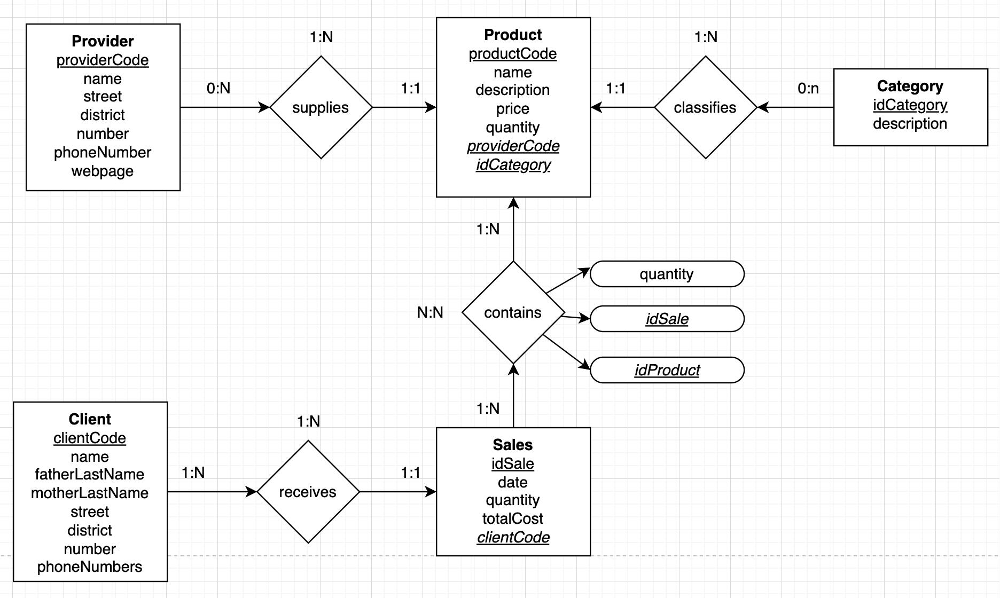

# Entity-Relation Model

## Entity
Any real world concept that can be tangible or not.
It is always represented with an rectangle and a sustantive.
Exists two types of entities, strong and weak.
Strong: It doesn't requires of other one to exist.

## Relation
Describes how works an entity with other. It's an correspondence or asosiation between 2 entities.
It is always identified by an verb.
We have diferent degrees of relation: binary, ternary, etc.

In some cases we can have a recursive relation "An employee who is boss of an employee".

### Cardinality.
| | |
|-|-|
| $0$ | If each instance of the entity can be or not in the relation. |
| $1$ | Each instance must be in the relation. |
| $n$ or $m$ or $∞$ | Each instance can be in the relation zero or more times. |

*Examples* 

## Identifier
Examples of identifiers are: the tuition, the RFC, the CURP.

## Keys
#### Primary Key
#### Unique Key
#### Foreign Key
#### Super key
#### Candidate key

In an example, we can use the RFC as an primary key, but as an candidate key the CURP.

## Excercise: Sales System 
Has diferent entities:
* **Provider**. Identifier (providerCode), name, street, district, number, phoneNumber, webpage.

* **Client**. Identifier (clientCode), name, fatherLastName, motherLastName, street, district, number, phoneNumbers.

* **Product**. Identifier (productCode), name, description, price, quantity.

* **Category**. Identifier, description.

* **Sales**. Identifier, date, quantity, totalCost.
    Quantity per product.

## Homework to March 5, 2024: Hotel Chain
Se trata de realizar el diseño de la base de datos en el modelo E-R para una cadena de hoteles.

Cada hotel(del que interesa almacenar su nombre, dirección, teléfono, año de contrucción, etc.)se encuentra clasificado obligatoriamente en una categoría(por ejemplo, tres estrellas), pudiendo bajar o aumentar de categoría. Cada categoría tiene asociada diversas informaciones, como , por ejemplo, el tipo de IVA que le corresponde.
Los hoteles tienen diferentes clases de habitaciones(suites, dobles, individuales, etc.). Las habitaciones se numeran de forma que se pueda identificar fácilmente la planta en la que se encuentran.
las reservas las pueden realizar tanto personas particulares como agencias de viajes. En la reserva figurán el nombre, direcciones, teléfono y otros datos relativos a la persona que realiza la reserva. En caso de tratarse de una agencia de viaje, se necesitarán los mismos datos datos, además del nombre de la persona para quien la agencia de viajes está realiando la reserva. También se deberá indicar la categoría del hotel(o el hotel) que se desea, el periodo de la estancia y la clase de habitación.
El sistema de gestionar los clientes de la cadena de hoteles, lo que supone almacenar los datos de las personas que han sido huéspedes de algún hotel de la cadena, sus diferentes estancias, gastos realizados y las facturas asociadas.
La tarifa de las habitaciones depende, ademas, del hotel y de la clase de habitación, así como de la temporada(alta, baja, etc.) de que se trate.

* **Hotel**. Identifier(hotelCode), name, direction, phoneNumber, yearOfConstruction, category.
* **Category**. Identifier(idCategory), Stars, IVA.
* **RoomType**. Identifier(roomTypeCode), name.
* **Room**. Identifier(roomCode), floor, roomType.
* **Reservation**. Identifier(idReservation),applicantName, address, phone, beneficiary name, category, roomType, arrival date, departure date;
* **Residence**. Identifier(idResidence), room, fee, client.
* **Clients**. Identifier(idClient), name.
* **Fee**. Identifier(idFee), Season, hotel, roomType.